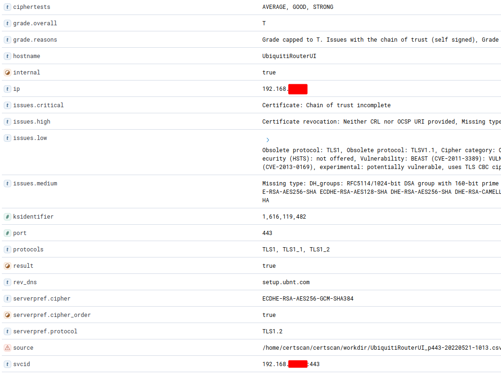
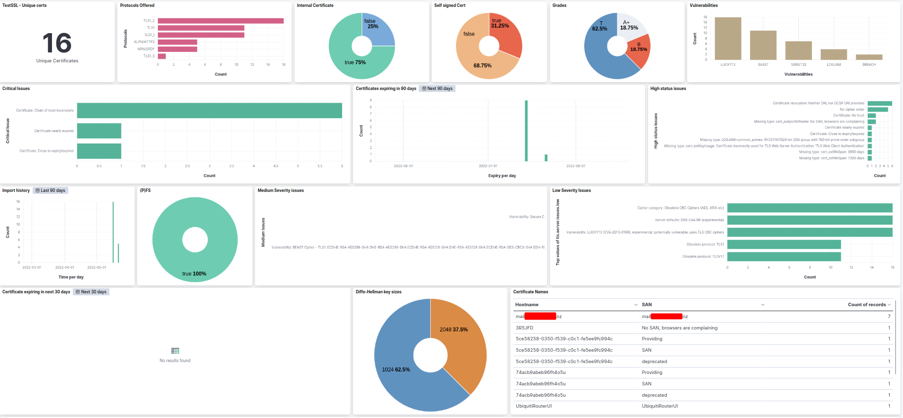

# Mass Scan Tools for testssl.sh
 

Script collection for generating [testssl.sh](https://testssl.sh/) command lines that can be executed sequentially or in
parallel with tools like [GNU Parallel](https://www.gnu.org/software/parallel/) and importing the results into a
structured document in [ElasticSearch](https://www.elastic.co/de/products/elasticsearch) for further analysis.

This fork provides a number of changes:
  - Elastic 7.x support
  - Testssl.sh 3.1dev version support (April 2022)
  - Added additional STARTTLS ports
  - various field updates
  - Elastic ECS fields where appropriate
  - Dashboard for Kibana
  - Read additional configuration created by gooseleggs/certscan scanning script (such as local/external host)
  

This is how the scan result of a service appears in Kibana:

Dashboard included:

## Dependencies

* testssl.sh 3.1dev branch or later version
* Python 3 with following modules:
  * elasticsearch\_dsl
  * tzlocal

## Usage

1. Install dependencies (see above)
2. Create input file with one `host:port` pair per line.
3. Run `generate_scan_file.py inputfile > cmdfile` to generate file with testssl.sh command lines.
4. Run `parallel < cmdfile` to perform testssl.sh scans.
5. Run `import_testssl.sh_csv_to_ES.py *.csv` to import scan results into ElasticSearch.
6. View/Analyze data with [Kibana](https://www.elastic.co/de/products/kibana) or the tool of your choice.
7. Fix your TLS configurations :)

# Known issues
Due to the way in which Elastic does aggregates, I could not get it to work correctly with returning just the last scan results for the dashboard.  Therefore, if you set the time line to more than a scan interval, the dashboard will show skewed results.  Not sure how to fix this at the moment, but open to suggestions (ie pull requests).

## Useful Command Lines

List all vulnerabilities in "host;port;vulnerabilities" CSV format:

    curl -qsk 'localhost:9200/testssl-*/_search?q=_exists_:vulnerabilities&size=10000' | jq -r '.hits.hits[]._source | [ .ip, ( .port | tostring ), ( .vulnerabilities | join(", ") ) ] | join(";")'

...and add ciphertests field:

    curl -qsk 'localhost:9200/testssl-*/_search?q=_exists_:(vulnerabilities+ciphertests)&size=10000' | jq -r '.hits.hits[]._source | [ .ip, ( .port | tostring ), ( .vulnerabilities | if . == null then "" else (. | join(", ") ) end ), ( .ciphertests | if . == null then "" else (. | join(", ") ) end ) ] | join(";")
